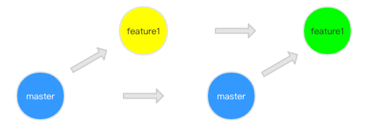

# Rebase 

## rebase 场景一 如何合并多次提交commit记录?

只要你的本地分支上需要 rebase 的所有 commits 历史还没有被 push 过，就可以安全地使用 git-rebase来操作。

```git
// 假设你想合并连续已经提交的3个commit
git rebase -i head~3

// 出现大致如下界面
pick xxxx fix-第一次提交
pick xxxx fix-第二次提交
pick xxxx fix-第三次提交
// 修改每行第一个command名称，如下 s表示将当前提交和上次提交合并
p xxxx fix-第一次提交
s xxxx fix-第二次提交
s xxxx fix-第三次提交
// :wq保存提交后，会提示你编辑commit message 信息，删除一些无用的信息，手动编写如下
fix 合并多个提交
// :wq保存提交
git log // 可以发现，三次commit提交合并成一个commit提交了
```

## rebase 场景二 分支合并

1. 你从master主分支切出一个开发feature分支，进行开发;
2. 你的同事往master主分支成功提交了一个记录，现在master分支超前你的开发feature分支；
3. 此时，你想要合并代码
 
使用merge 合并，提交记录会是这样



使用rebase 合并，提交记录会是这样


> 首先，git 会把 feature1 分支里面的每个 commit 取消掉；
> 其次，把上面的操作临时保存成 patch 文件，存在 .git/rebase 目录下；
> 然后，把 feature1 分支更新到最新的 master 分支；
> 最后，把上面保存的 patch 文件应用到 feature1 分支上；

如果在git rebase master 过程中出现冲突，你可以解决完冲突后，`git add` 更新相关内容后，执行 `git rebase --continue`, git 会继续应用余下的 patch 补丁文件。

> rebase 合并了commit记录，保持分支整洁，相比merge 它减少了分支合并的记录。